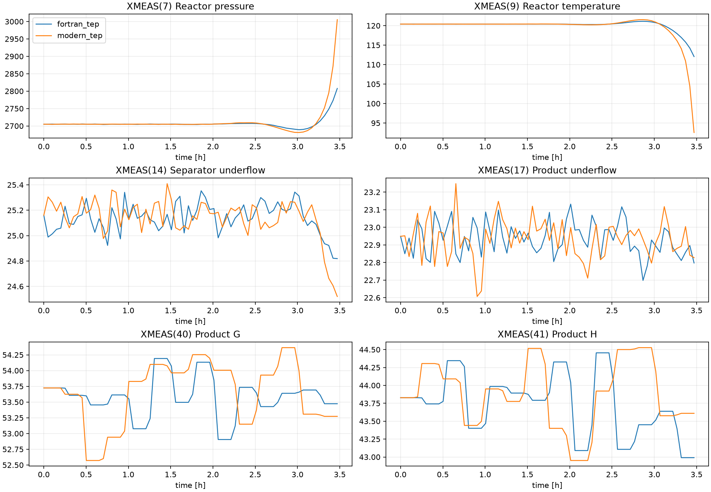
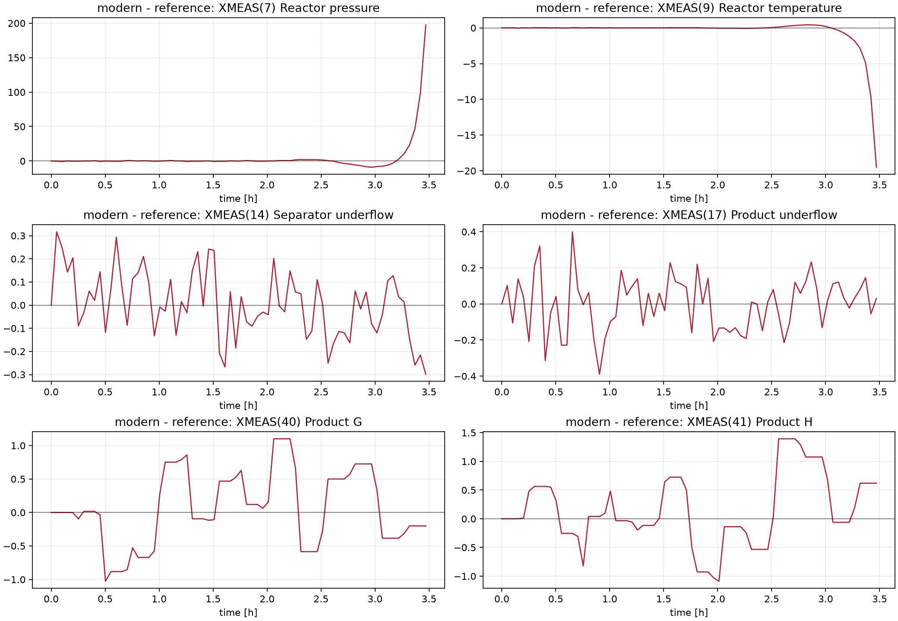
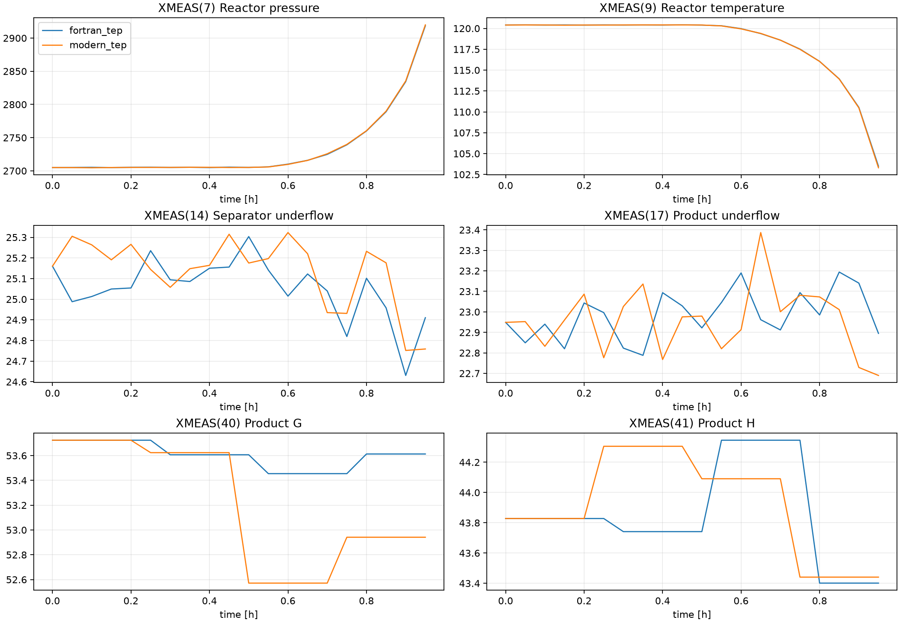
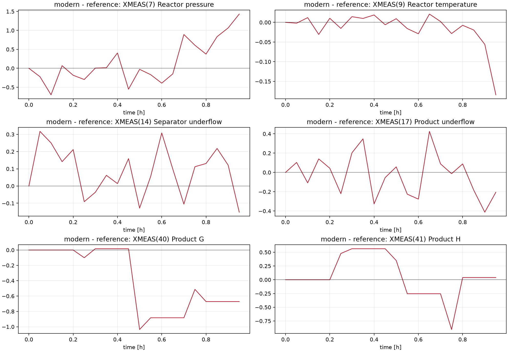
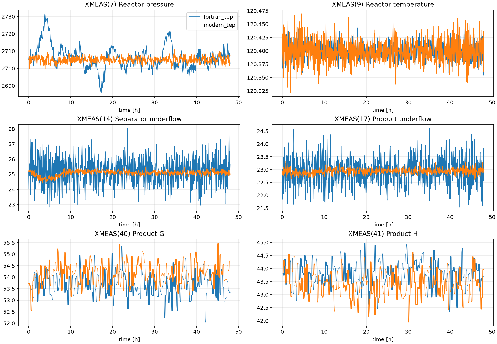
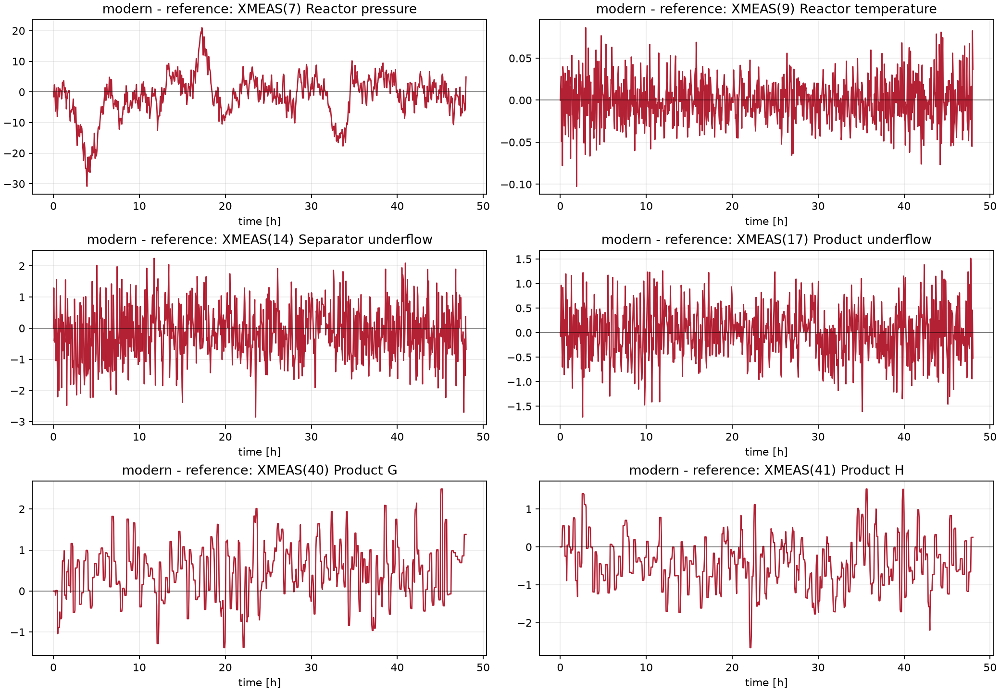
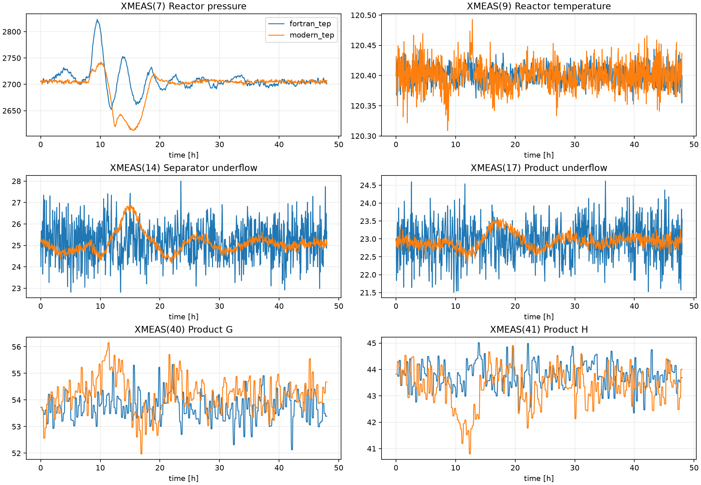
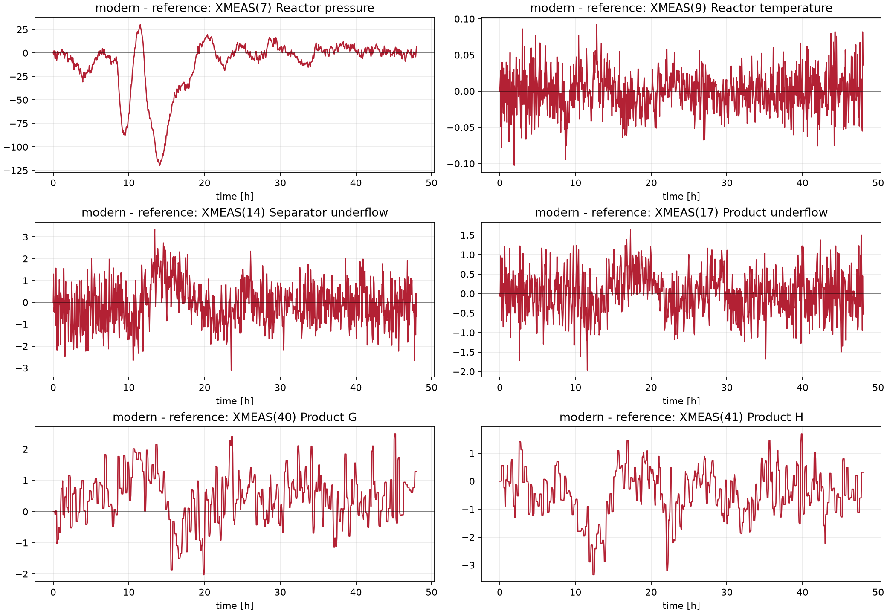

# Tennessee Eastman Process Implementasyon Karsilastirmasi

Olusturma zamani: 2026-09-29T22:06:56

## Ortam Saglik Kontrolu

| Kontrol | Sonuc |
| --- | --- |
| Calisma dizini | C:\Users\Aybars\Desktop\envComp |
| Beklenen dizin | C:\Users\Aybars\Desktop\envComp |
| Yol beklenenle ayni mi | True |
| Yolda bosluk var mi | False |
| Python | 3.12.14 (main, Aug 25 2026, 14:01:42) [MSC v.1944 64 bit (AMD64)] |
| Python executable | C:\Users\Aybars\.cache\codex-runtimes\codex-primary-runtime\dependencies\python\python.exe |
| Platform | Windows-11-10.0.26200-SP0 |

### Paketler ve Derleyiciler

| Paket | Var | Versiyon | Kaynak |
| --- | --- | --- | --- |
| numpy | True | 2.5.3 | C:\Users\Aybars\AppData\Roaming\Python\Python312\site-packages\numpy\__init__.py |
| scipy | True | 1.18.0 | C:\Users\Aybars\AppData\Roaming\Python\Python312\site-packages\scipy\__init__.py |
| matplotlib | True | 3.11.0 | C:\Users\Aybars\AppData\Roaming\Python\Python312\site-packages\matplotlib\__init__.py |
| cffi | True | 2.1.1 | C:\Users\Aybars\.cache\codex-runtimes\codex-primary-runtime\dependencies\python\Lib\site-packages\cffi\__init__.py |
| _cffi_backend | True | 2.1.1 | C:\Users\Aybars\.cache\codex-runtimes\codex-primary-runtime\dependencies\python\Lib\site-packages\_cffi_backend.cp312-win_amd64.pyd |
| gymnasium | False | not installed |  |

| Arac | Var | Versiyon | Executable |
| --- | --- | --- | --- |
| gfortran | True | GNU Fortran (MinGW-W64 x86_64-ucrt-posix-seh, built by Brecht Sanders, r8) 13.2.0 | C:\Strawberry\c\bin\gfortran.EXE |
| gcc | True | gcc (MinGW-W64 x86_64-ucrt-posix-seh, built by Brecht Sanders, r8) 13.2.0 | C:\Strawberry\c\bin\gcc.EXE |
| ninja | True | 1.12.0 | C:\Strawberry\c\bin\ninja.EXE |
| meson | False | not found |  |

Eski Meson/editable import hook kalintisi gorulmedi.

### Backend Smoke Testleri

| Probe | OK | Cikti |
| --- | --- | --- |
| installed_site_packages_tep_fortran | True | C:\Users\Aybars\AppData\Roaming\Python\Python312\site-packages\tep\__init__.py fortran 2704.9999842463267 |
| workspace_fortran_tep_fortran | False | ImportError: Fortran backend not available. Install with 'pip install -e .' or use backend='python'. Error: Fortran extension not available: No module named 'tep._fortran.teprob' Install with: pip install .[dev] (requires gfortran) |
| workspace_fortran_tep_python | True | python; XMEAS7=2705 |
| modern_tep_native | True | reset_shape=(41,); advance_time=0.001; XMEAS7=2705.063002; terminated=False |

## Kisa Sonuc

Bu rapor `fortran_tep` referans sarmalayicisi ile `modern_tep` CFFI tabanli modern cekirdegini Mode 1 baslangicindan karsilastirir. Dinamik kosular ayni baslangic MV'leri, ayni seed ve ortak XMEAS indeksleri uzerinden hizalanir.
Workspace icindeki `fortran_tep` native f2py modulu yuklenemedigi icin dinamik referans kosularinda `backend='python'` kullanildi. Site-packages `tep` Fortran backend smoke testi ayri olarak raporlandi; bu kurulu paket workspace checkout'i olmadigi icin ana karsilastirmada referans alinmadi.
`modern_tep` native CFFI cekirdegi reset/advance smoke testini gecti.
Gymnasium kurulu degil. `modern_tep` import guard'i proses cekirdegini bozmadigi icin bu durum RL adapter kullanilabilirligiyle sinirlidir.

## Statik ve Mimari Analiz

| Baslik | fortran_tep | modern_tep |
| --- | --- | --- |
| Cekirdek | `teprob.f` / `TEINIT` / `TEFUNC`; Python portu ve opsiyonel f2py | `temexd_mod.c` native C cekirdegi; CFFI bridge |
| Durum sayisi | 50 adet `YY(1:50)` | 50 adet schema'li state; `legacy_index` YY ile uyumlu |
| Olcumler | 41 adet `XMEAS`; 22 surekli + 19 analizor | 41 adet online measurement; analizor sample-and-hold metadata'si var |
| MV | 12 adet `XMV`; ilk 11 valve 0-100, 12 agitator | 12 adet bounded action/MV, 0-100% |
| IDV | 20 klasik IDV | 28 IDV; ilk 20 ortak, 21-28 genisletme |
| Integrator | High-level wrapper 1 s explicit Euler uygular | Varsayilan fixed-step RK4 (`fixed_step=0.0005 h`); Euler ve SciPy RK23/RK45 secilebilir |
| Kinetik | Arrhenius ifadeleri ve kismi basinc kuvvetleri TEFUNC icinde | Ayni TEP ailesinin native C kinetigi; ek monitor/disturbance ciktilari var |
| VLE / termodinamik | Antoine buhar basinci, entalpi ve yogunluk yardimci subroutine'leri | Native C cekirdekte legacy termodinamik; schema dis yuzeyi adlandirir |
| RL / Gymnasium | Dogal Gym API yok; custom controller/detector var | `GymTEPEnv`, Box action/observation, terminated/truncated ayrimi |
| LLM / MCP | MCP arayuzu yok | `tep_studio.agent.mcp_server` ile MCP tool server |

### Numerik ve Fiziksel Model Notlari

| Konu | Gozlem |
| --- | --- |
| Fortran wrapper integrasyonu | `TEPSimulator.dt = 1/3600 h`; her adimda kontrol/MV guncellemesi, `TEFUNC` turevi ve explicit Euler `YY <- YY + YP*dt` uygulanir. |
| Fortran backend cagrisi | f2py sarmalayici `TEINIT` ile baslatir, `FortranTEProcess.evaluate()` icinde `teprob.tefunc(nn, time, yy)` cagrisi yapar. |
| Modern integrator | `TennesseeEastmanProcess` varsayilan olarak fixed-step RK4 kullanir (`fixed_step=0.0005 h`); `Euler` ayni fixed-step dongusunde, `RK23/RK45` ise SciPy `solve_ivp` ile calisir. |
| Kinetik | Klasik TEFUNC ailesinde Arrhenius ifadeleri reaktor sicakligina ve kismi basinclara baglidir; ana hizlar A/C/D/E bilesen kismi basinclariyla carpilir ve G/H/F uretim-tuketim terimlerine dagitilir. |
| VLE ve termodinamik | A-C non-condensable kabul edilir; D-H icin Antoine `ln(P)=A+B/(T+C)`, sivi yogunluk polinomu, sivi/gaz entalpi polinomlari ve buharlasma isi katsayilari kullanilir. |
| Ayrim/stripper | Stripper basitlestirmesi ampirik ayrim faktorleriyle calisir; bu faktorler buhar/sivi oranina ve sicaklik bagimli `tmpfac` terimine gore guncellenir. |
| Modern genisletmeler | `modern_tep` 28 IDV, 32 ek olcum, 21 disturbance monitor, 62 process monitor ve 96 concentration monitor metadata'si tasir; klasik `fortran_tep` dis arayuzu 20 IDV/41 XMEAS ile sinirlidir. |

### XMEAS Eslesmesi

| i | Fortran | Birim | Modern schema | Modern timing |
| --- | --- | --- | --- | --- |
| 1 | A Feed (stream 1) | kscmh | feed_A_flow | continuous |
| 2 | D Feed (stream 2) | kg/hr | feed_D_flow | continuous |
| 3 | E Feed (stream 3) | kg/hr | feed_E_flow | continuous |
| 4 | A and C Feed (stream 4) | kscmh | feed_AC_flow | continuous |
| 5 | Recycle Flow (stream 8) | kscmh | recycle_flow | continuous |
| 6 | Reactor Feed Rate (stream 6) | kscmh | reactor_feed_flow | continuous |
| 7 | Reactor Pressure | kPa | reactor_pressure | continuous |
| 8 | Reactor Level | % | reactor_level | continuous |
| 9 | Reactor Temperature | deg C | reactor_temperature | continuous |
| 10 | Purge Rate (stream 9) | kscmh | purge_flow | continuous |
| 11 | Product Sep Temp | deg C | separator_temperature | continuous |
| 12 | Product Sep Level | % | separator_level | continuous |
| 13 | Prod Sep Pressure | kPa | separator_pressure | continuous |
| 14 | Prod Sep Underflow (stream 10) | m3/hr | separator_underflow | continuous |
| 15 | Stripper Level | % | stripper_level | continuous |
| 16 | Stripper Pressure | kPa | stripper_pressure | continuous |
| 17 | Stripper Underflow (stream 11) | m3/hr | stripper_underflow | continuous |
| 18 | Stripper Temperature | deg C | stripper_temperature | continuous |
| 19 | Stripper Steam Flow | kg/hr | stripper_steam_flow | continuous |
| 20 | Compressor Work | kW | compressor_work | continuous |
| 21 | Reactor Cooling Water Outlet Temp | deg C | reactor_cooling_water_outlet_temperature_meas | continuous |
| 22 | Separator Cooling Water Outlet Temp | deg C | condenser_cooling_water_outlet_temperature | continuous |
| 23 | Reactor Feed Component A | mol% | reactor_feed_A_concentration | sample_and_hold |
| 24 | Reactor Feed Component B | mol% | reactor_feed_B_concentration | sample_and_hold |
| 25 | Reactor Feed Component C | mol% | reactor_feed_C_concentration | sample_and_hold |
| 26 | Reactor Feed Component D | mol% | reactor_feed_D_concentration | sample_and_hold |
| 27 | Reactor Feed Component E | mol% | reactor_feed_E_concentration | sample_and_hold |
| 28 | Reactor Feed Component F | mol% | reactor_feed_F_concentration | sample_and_hold |
| 29 | Purge Gas Component A | mol% | purge_A_concentration | sample_and_hold |
| 30 | Purge Gas Component B | mol% | purge_B_concentration | sample_and_hold |
| 31 | Purge Gas Component C | mol% | purge_C_concentration | sample_and_hold |
| 32 | Purge Gas Component D | mol% | purge_D_concentration | sample_and_hold |
| 33 | Purge Gas Component E | mol% | purge_E_concentration | sample_and_hold |
| 34 | Purge Gas Component F | mol% | purge_F_concentration | sample_and_hold |
| 35 | Purge Gas Component G | mol% | purge_G_concentration | sample_and_hold |
| 36 | Purge Gas Component H | mol% | purge_H_concentration | sample_and_hold |
| 37 | Product Component D | mol% | stripper_underflow_D_concentration | sample_and_hold |
| 38 | Product Component E | mol% | stripper_underflow_E_concentration | sample_and_hold |
| 39 | Product Component F | mol% | stripper_underflow_F_concentration | sample_and_hold |
| 40 | Product Component G | mol% | stripper_underflow_G_concentration | sample_and_hold |
| 41 | Product Component H | mol% | stripper_underflow_H_concentration | sample_and_hold |

### XMV Eslesmesi

| i | Fortran | Modern schema | Baslangic |
| --- | --- | --- | --- |
| 1 | D Feed Flow (stream 2) | d_feed_valve | 63.05263039 |
| 2 | E Feed Flow (stream 3) | e_feed_valve | 53.97970677 |
| 3 | A Feed Flow (stream 1) | a_feed_valve | 24.64355755 |
| 4 | A and C Feed Flow (stream 4) | ac_feed_valve | 61.30192144 |
| 5 | Compressor Recycle Valve | compressor_recycle_valve | 22.21 |
| 6 | Purge Valve (stream 9) | purge_valve | 40.06374673 |
| 7 | Separator Pot Liquid Flow | separator_underflow_valve | 38.1003437 |
| 8 | Stripper Liquid Product Flow | stripper_underflow_valve | 46.53415582 |
| 9 | Stripper Steam Valve | stripper_steam_valve | 47.44573456 |
| 10 | Reactor Cooling Water Flow | reactor_cooling_water_valve | 41.10581288 |
| 11 | Condenser Cooling Water Flow | separator_cooling_water_valve | 18.11349055 |
| 12 | Agitator Speed | reactor_agitator_speed | 50 |

### State Eslesmesi

Tum 50 satir `state_mapping.csv` dosyasina da yazildi.

| i | Fortran | Modern state | Birim | Baslangic |
| --- | --- | --- | --- | --- |
| 1 | YY(1) | reactor_vapor_A_holdup | lb-mol | 10.40491389 |
| 2 | YY(2) | reactor_vapor_B_holdup | lb-mol | 4.363996017 |
| 3 | YY(3) | reactor_vapor_C_holdup | lb-mol | 7.570059737 |
| 4 | YY(4) | reactor_liquid_D_holdup | lb-mol | 0.4230042431 |
| 5 | YY(5) | reactor_liquid_E_holdup | lb-mol | 24.15513437 |
| 6 | YY(6) | reactor_liquid_F_holdup | lb-mol | 2.942597645 |
| 7 | YY(7) | reactor_liquid_G_holdup | lb-mol | 154.3770655 |
| 8 | YY(8) | reactor_liquid_H_holdup | lb-mol | 159.186596 |
| 9 | YY(9) | reactor_internal_energy | MMBTU | 2.808522723 |
| 10 | YY(10) | separator_vapor_A_holdup | lb-mol | 63.75581199 |
| 11 | YY(11) | separator_vapor_B_holdup | lb-mol | 26.74026066 |
| 12 | YY(12) | separator_vapor_C_holdup | lb-mol | 46.38532432 |
| 13 | YY(13) | separator_liquid_D_holdup | lb-mol | 0.2464521543 |
| 14 | YY(14) | separator_liquid_E_holdup | lb-mol | 15.20484404 |
| 15 | YY(15) | separator_liquid_F_holdup | lb-mol | 1.852266172 |
| 16 | YY(16) | separator_liquid_G_holdup | lb-mol | 52.44639459 |
| 17 | YY(17) | separator_liquid_H_holdup | lb-mol | 41.20394008 |
| 18 | YY(18) | separator_internal_energy | MMBTU | 0.569931776 |
| 19 | YY(19) | stripper_liquid_A_holdup | lb-mol | 0.4306056376 |
| 20 | YY(20) | stripper_liquid_B_holdup | lb-mol | 0.007990620078 |
| 21 | YY(21) | stripper_liquid_C_holdup | lb-mol | 0.9056036089 |
| 22 | YY(22) | stripper_liquid_D_holdup | lb-mol | 0.01605425822 |
| 23 | YY(23) | stripper_liquid_E_holdup | lb-mol | 0.7509759687 |
| 24 | YY(24) | stripper_liquid_F_holdup | lb-mol | 0.08858285595 |
| 25 | YY(25) | stripper_liquid_G_holdup | lb-mol | 48.27726193 |
| 26 | YY(26) | stripper_liquid_H_holdup | lb-mol | 39.38459028 |
| 27 | YY(27) | stripper_internal_energy | MMBTU | 0.3755297257 |
| 28 | YY(28) | header_vapor_A_holdup | lb-mol | 107.7562698 |
| 29 | YY(29) | header_vapor_B_holdup | lb-mol | 29.77250546 |
| 30 | YY(30) | header_vapor_C_holdup | lb-mol | 88.32481135 |
| 31 | YY(31) | header_vapor_D_holdup | lb-mol | 23.03929507 |
| 32 | YY(32) | header_vapor_E_holdup | lb-mol | 62.85848794 |
| 33 | YY(33) | header_vapor_F_holdup | lb-mol | 5.546318688 |
| 34 | YY(34) | header_vapor_G_holdup | lb-mol | 11.92244772 |
| 35 | YY(35) | header_vapor_H_holdup | lb-mol | 5.555448243 |
| 36 | YY(36) | header_internal_energy | MMBTU | 0.9218489762 |
| 37 | YY(37) | reactor_cooling_water_outlet_temperature | degC | 94.59927549 |
| 38 | YY(38) | separator_cooling_water_outlet_temperature | degC | 77.29698353 |
| 39 | YY(39) | d_feed_valve | % | 63.05263039 |
| 40 | YY(40) | e_feed_valve | % | 53.97970677 |
| 41 | YY(41) | a_feed_valve | % | 24.64355755 |
| 42 | YY(42) | ac_feed_valve | % | 61.30192144 |
| 43 | YY(43) | compressor_recycle_valve | % | 22.21 |
| 44 | YY(44) | purge_valve | % | 40.06374673 |
| 45 | YY(45) | separator_underflow_valve | % | 38.1003437 |
| 46 | YY(46) | stripper_underflow_valve | % | 46.53415582 |
| 47 | YY(47) | stripper_steam_valve | % | 47.44573456 |
| 48 | YY(48) | reactor_cooling_water_valve | % | 41.10581288 |
| 49 | YY(49) | separator_cooling_water_valve | % | 18.11349055 |
| 50 | YY(50) | reactor_agitator_speed | % | 50 |

## Dinamik Dogrulama

Ayarlar: horizon=48.0 h, record_dt=0.05 h, modern solver=RK4, modern fixed_step=0.0005 h, modern control interval=0.01 h, seed=4651207995.

### Kosu Ozeti

| Senaryo | Implementasyon | Durum | Final h | Shutdown h | Wall s | ms/proc-h | Samples | Hata |
| --- | --- | --- | --- | --- | --- | --- | --- | --- |
| open_loop_base | fortran_tep:python | shutdown | 3.55 | 3.5855556 | 4.3356726 | 1221.3162 | 72 |  |
| open_loop_base | modern_tep:RK4 | shutdown | 3.47 | 3.47 | 0.0853964 | 24.609914 | 71 |  |
| open_loop_idv | fortran_tep:python | shutdown | 0.95 | 0.97861111 | 1.1628987 | 1224.1039 | 20 |  |
| open_loop_idv | modern_tep:RK4 | shutdown | 0.98 | 0.98 | 0.0244733 | 24.972755 | 21 |  |
| closed_loop_base | fortran_tep:python | completed | 48 |  | 70.971111 | 1478.5648 | 961 |  |
| closed_loop_base | modern_tep:RK4+Ricker | completed | 48 |  | 1.3904503 | 28.967715 | 961 |  |
| closed_loop_idv | fortran_tep:python | completed | 48 |  | 69.185313 | 1441.3607 | 961 |  |
| closed_loop_idv | modern_tep:RK4+Ricker | completed | 48 |  | 1.3527945 | 28.183219 | 961 |  |

### Backend Hiz Karsilastirmasi

| Implementasyon | Kosular | Toplam wall s | Toplam proses h | Agirlikli ms/proc-h | Durumlar |
| --- | --- | --- | --- | --- | --- |
| fortran_tep:python | 4 | 145.655 | 100.5 | 1449.3 | completed, shutdown |
| modern_tep:RK4 | 2 | 0.10987 | 4.45 | 24.6898 | shutdown |
| modern_tep:RK4+Ricker | 2 | 2.74324 | 96 | 28.5755 | completed |

Not: `installed_site_packages_tep_fortran` smoke testi calisti, ancak workspace checkout'i degil. Bu nedenle senaryo runtime tablolarinda ana referans olarak workspace `fortran_tep:python` kullanildi.

### Hata Metrikleri

| Senaryo | XMEAS | Olcum | N | Until h | MaxAbs | MeanAbs | RMSE | Rel RMSE % |
| --- | --- | --- | --- | --- | --- | --- | --- | --- |
| open_loop_base | 7 | XMEAS(7) Reactor pressure | 70 | 3.47 | 197.64668 | 6.6848648 | 27.270161 | 1.0073098 |
| open_loop_base | 9 | XMEAS(9) Reactor temperature | 70 | 3.47 | 19.50113 | 0.64499434 | 2.7091129 | 2.2563949 |
| open_loop_base | 14 | XMEAS(14) Separator underflow | 70 | 3.47 | 0.31678685 | 0.11536294 | 0.1422533 | 0.56590411 |
| open_loop_base | 17 | XMEAS(17) Product underflow | 70 | 3.47 | 0.39968114 | 0.12212855 | 0.15038562 | 0.65574387 |
| open_loop_base | 40 | XMEAS(40) Product G | 70 | 3.47 | 1.1003718 | 0.45418744 | 0.55796578 | 1.0412549 |
| open_loop_base | 41 | XMEAS(41) Product H | 70 | 3.47 | 1.3933998 | 0.46857171 | 0.62786406 | 1.4359357 |
| open_loop_idv | 7 | XMEAS(7) Reactor pressure | 20 | 0.95 | 1.4314489 | 0.41929055 | 0.57114799 | 0.020900082 |
| open_loop_idv | 9 | XMEAS(9) Reactor temperature | 20 | 0.95 | 0.1841627 | 0.024631413 | 0.045851598 | 0.038787882 |
| open_loop_idv | 14 | XMEAS(14) Separator underflow | 20 | 0.95 | 0.31717438 | 0.13558191 | 0.16076314 | 0.6417307 |
| open_loop_idv | 17 | XMEAS(17) Product underflow | 20 | 0.95 | 0.42516175 | 0.17599891 | 0.2163369 | 0.94126806 |
| open_loop_idv | 40 | XMEAS(40) Product G | 20 | 0.95 | 1.0353486 | 0.39672063 | 0.5598354 | 1.0443708 |
| open_loop_idv | 41 | XMEAS(41) Product H | 20 | 0.95 | 0.90439587 | 0.25811135 | 0.36771598 | 0.83857102 |
| closed_loop_base | 7 | XMEAS(7) Reactor pressure | 960 | 48 | 30.843057 | 5.042693 | 7.0679462 | 0.26115631 |
| closed_loop_base | 9 | XMEAS(9) Reactor temperature | 960 | 48 | 0.10250236 | 0.020337483 | 0.026006037 | 0.021599636 |
| closed_loop_base | 14 | XMEAS(14) Separator underflow | 960 | 48 | 2.8531013 | 0.67983314 | 0.84991888 | 3.3721157 |
| closed_loop_base | 17 | XMEAS(17) Product underflow | 960 | 48 | 1.7195982 | 0.41034906 | 0.5149805 | 2.2449642 |
| closed_loop_base | 40 | XMEAS(40) Product G | 960 | 48 | 2.4889154 | 0.66848141 | 0.82765836 | 1.5417845 |
| closed_loop_base | 41 | XMEAS(41) Product H | 960 | 48 | 2.6616527 | 0.63748779 | 0.78694583 | 1.7961121 |
| closed_loop_idv | 7 | XMEAS(7) Reactor pressure | 960 | 48 | 119.73911 | 16.653153 | 30.18589 | 1.1144179 |
| closed_loop_idv | 9 | XMEAS(9) Reactor temperature | 960 | 48 | 0.10250236 | 0.021460707 | 0.027509388 | 0.022848263 |
| closed_loop_idv | 14 | XMEAS(14) Separator underflow | 960 | 48 | 3.3500692 | 0.76481816 | 0.95739784 | 3.8015516 |
| closed_loop_idv | 17 | XMEAS(17) Product underflow | 960 | 48 | 1.9616582 | 0.44123076 | 0.55207884 | 2.4066466 |
| closed_loop_idv | 40 | XMEAS(40) Product G | 960 | 48 | 2.48968 | 0.74175322 | 0.92511938 | 1.7211905 |
| closed_loop_idv | 41 | XMEAS(41) Product H | 960 | 48 | 3.3466434 | 0.75901431 | 0.98434896 | 2.2478733 |

Not: Kullanici istegindeki `MAE` ifadesi burada `MaxAbs` (maksimum mutlak sapma) ve ek olarak `MeanAbs` ile ayrildi; `Rel RMSE %`, RMSE'nin referans ortalama mutlak degerine oranidir.

## Kullanilabilirlik, RL ve Agent Katmani

| Baslik | Degerlendirme |
| --- | --- |
| Gymnasium | `modern_tep` kodu `GymTEPEnv` saglar: observation space 41 online XMEAS, direct-MV action space 12 boyutlu `Box(0,100)`, opsiyonel setpoint action modu ve `terminated`/`truncated` ayrimi. Bu ortamda `gymnasium` kurulu degil; proses cekirdegi yine calisti. |
| fortran_tep RL | Dogal Gymnasium adapter yok. `TEPSimulator` ve controller API ile ozel ortam yazilabilir, ama termination, action/observation schema ve dataset kaydi modern paket kadar hazir degil. |
| MCP / LLM | `modern_tep` icinde `tep_studio.agent.mcp_server` ve `TepToolset` katmani var; `mcp` ekstra bagimlilikla `tep-mcp` stdio server olarak calisir. `fortran_tep` icinde benzer MCP/tool server arayuzu bulunmadi. |
| PPO | Egitim ortami icin `modern_tep` daha uygun: native CFFI hizli, Gym API dogrudan, episode bitisi acik ve schema/action metadata hazir. `fortran_tep` daha cok referans/dogrulama ve klasik 20-IDV veri uretimi icin konumlanmali. |
| Mamba+PPO | Sequence model egitimi icin modern schema, monitor katmanlari ve hiz avantaj saglar. Ancak politika egitiminde closed-loop/Ricker stabil senaryolari ve termination cezasi dikkatle tasarlanmali; acik cevrim dogal shutdown bir model hatasi degil, ortam dinaminin parcasi. |

### Sapma Grafikleri

## Cikti Dosyalari

- `state_mapping.csv`, `measurement_mapping.csv`, `mv_mapping.csv`, `disturbance_mapping.csv`
- `run_summary.csv`, `metrics.csv`, `runs.json`
- `trajectory_*.png`, `deviation_*.png`